# CliAgent

**CliAgent** is a powerful, extensible command-line and Python tool for automating Python code understanding and transformation tasks. It 
leverages advanced LLMs to generate docstrings, summaries, type annotations, tests, bug detection, refactoring, and more—all from your terminal 
or scripts.

<!-- ARCHITECTURE DIAGRAM START -->

```mermaid
flowchart TD
    %% User Interaction
    subgraph User["User"]
        U1["CLI / Chat Input"]
        U2["CLI / Chat Output"]
    end

    %% CLI Entrypoint
    subgraph Entrypoint["Entrypoint Layer"]
        M1["main.py\n(Argparse, Entrypoint)"]
        M2["__main__.py\n(Python -m Entrypoint)"]
    end

    %% Flow Orchestration
    subgraph Flow["Flow & Orchestration"]
        F1["flow.py\n(Flow Logic)"]
        F2["nodes.py\n(Agent Nodes)"]
    end

    %% Node Types
    subgraph Nodes["Agent Nodes"]
        N1["DocAgentNode"]
        N2["SummaryAgentNode"]
        N3["TestGenerationAgentNode"]
        N4["BugDetectionAgentNode"]
        N5["RefactorCodeAgentNode"]
        N6["TypeAnnotationAgentNode"]
        N7["MigrationAgentNode"]
        N8["Orchestrator/Intent/Approval Nodes"]
        N9["FileManagementNode"]
        N10["SafetyCheckNode"]
        N11["ContextAwarenessNode"]
        N12["ErrorHandlingNode"]
    end

    %% Utilities
    subgraph Utils["Utilities"]
        UTL1["call_llm.py\n(AlchemistAIProxy)"]
        UTL2["utils.py"]
        UTL3["visualize_flow.py"]
    end

    %% LLM Cloud
    subgraph Cloud["Alchemyst AI Cloud"]
        C1["alchemyst-ai/alchemyst-c1\n(LLM Model)"]
    end

    %% Data Flow
    U1 --> M1
    U1 --> M2
    M1 --> F1
    M2 --> M1
    F1 --> F2
    F2 --> N1
    F2 --> N2
    F2 --> N3
    F2 --> N4
    F2 --> N5
    F2 --> N6
    F2 --> N7
    F2 --> N8
    F2 --> N9
    F2 --> N10
    F2 --> N11
    F2 --> N12
    N1 --> UTL1
    N2 --> UTL1
    N3 --> UTL1
    N4 --> UTL1
    N5 --> UTL1
    N6 --> UTL1
    N7 --> UTL1
    N8 --> UTL2
    N9 --> UTL2
    N10 --> UTL2
    N11 --> UTL2
    N12 --> UTL2
    UTL1 --> C1
    UTL2 --> C1
    UTL3 --> F1
    U2 <-- F1

    %% Style for high contrast
    style User fill:#222,color:#fff,stroke:#111,stroke-width:2px
    style Entrypoint fill:#0057b7,color:#fff,stroke:#003366,stroke-width:2px
    style Flow fill:#00897b,color:#fff,stroke:#004d40,stroke-width:2px
    style Nodes fill:#c62828,color:#fff,stroke:#7f0000,stroke-width:2px
    style Utils fill:#6a1b9a,color:#fff,stroke:#38006b,stroke-width:2px
    style Cloud fill:#f9a825,color:#222,stroke:#b28704,stroke-width:2px
    %% Node text bold for visibility
    classDef boldText fill:none,color:#fff,font-weight:bold,font-size:18px;
    class U1,U2,M1,M2,F1,F2,N1,N2,N3,N4,N5,N6,N7,N8,N9,N10,N11,N12,UTL1,UTL2,UTL3,C1 boldText;
```
<!-- ARCHITECTURE DIAGRAM END -->

## 🏗️ Architecture Overview

Below is a detailed architecture diagram of CliAgent, showing the flow from user input through the CLI, flow orchestration, agent nodes, utility layers, and the Alchemyst AI LLM cloud:

```mermaid
flowchart TD
    %% User Interaction
    subgraph User["User"]
        U1["CLI / Chat Input"]
        U2["CLI / Chat Output"]
    end

    %% CLI Entrypoint
    subgraph Entrypoint["Entrypoint Layer"]
        M1["main.py\n(Argparse, Entrypoint)"]
        M2["__main__.py\n(Python -m Entrypoint)"]
    end

    %% Flow Orchestration
    subgraph Flow["Flow & Orchestration"]
        F1["flow.py\n(Flow Logic)"]
        F2["nodes.py\n(Agent Nodes)"]
    end

    %% Node Types
    subgraph Nodes["Agent Nodes"]
        N1["DocAgentNode"]
        N2["SummaryAgentNode"]
        N3["TestGenerationAgentNode"]
        N4["BugDetectionAgentNode"]
        N5["RefactorCodeAgentNode"]
        N6["TypeAnnotationAgentNode"]
        N7["MigrationAgentNode"]
        N8["Orchestrator/Intent/Approval Nodes"]
        N9["FileManagementNode"]
        N10["SafetyCheckNode"]
        N11["ContextAwarenessNode"]
        N12["ErrorHandlingNode"]
    end

    %% Utilities
    subgraph Utils["Utilities"]
        UTL1["call_llm.py\n(AlchemistAIProxy)"]
        UTL2["utils.py"]
        UTL3["visualize_flow.py"]
    end

    %% LLM Cloud
    subgraph Cloud["Alchemyst AI Cloud"]
        C1["alchemyst-ai/alchemyst-c1\n(LLM Model)"]
    end

    %% Data Flow
    U1 --> M1
    U1 --> M2
    M1 --> F1
    M2 --> M1
    F1 --> F2
    F2 --> N1
    F2 --> N2
    F2 --> N3
    F2 --> N4
    F2 --> N5
    F2 --> N6
    F2 --> N7
    F2 --> N8
    F2 --> N9
    F2 --> N10
    F2 --> N11
    F2 --> N12
    N1 --> UTL1
    N2 --> UTL1
    N3 --> UTL1
    N4 --> UTL1
    N5 --> UTL1
    N6 --> UTL1
    N7 --> UTL1
    N8 --> UTL1
    N9 --> UTL1
    N10 --> UTL1
    N11 --> UTL1
    N12 --> UTL1
    UTL1 --> C1
    C1 -- "LLM Response" --> UTL1
    UTL1 -- "Result" --> N1
    UTL1 -- "Result" --> N2
    UTL1 -- "Result" --> N3
    UTL1 -- "Result" --> N4
    UTL1 -- "Result" --> N5
    UTL1 -- "Result" --> N6
    UTL1 -- "Result" --> N7
    UTL1 -- "Result" --> N8
    UTL1 -- "Result" --> N9
    UTL1 -- "Result" --> N10
    UTL1 -- "Result" --> N11
    UTL1 -- "Result" --> N12
    N1 --> F1
    N2 --> F1
    N3 --> F1
    N4 --> F1
    N5 --> F1
    N6 --> F1
    N7 --> F1
    N8 --> F1
    N9 --> F1
    N10 --> F1
    N11 --> F1
    N12 --> F1
    F1 --> M1
    M1 --> U2

    %% Style for solid colors
    style U1 fill:#f9d423,stroke:#e65c00,stroke-width:2px
    style U2 fill:#f9d423,stroke:#e65c00,stroke-width:2px
    style M1 fill:#36d1c4,stroke:#11998e,stroke-width:2px
    style M2 fill:#36d1c4,stroke:#11998e,stroke-width:2px
    style F1 fill:#43e97b,stroke:#38f9d7,stroke-width:2px
    style F2 fill:#43e97b,stroke:#38f9d7,stroke-width:2px
    style N1 fill:#f857a6,stroke:#ff5858,stroke-width:2px
    style N2 fill:#f857a6,stroke:#ff5858,stroke-width:2px
    style N3 fill:#f857a6,stroke:#ff5858,stroke-width:2px
    style N4 fill:#f857a6,stroke:#ff5858,stroke-width:2px
    style N5 fill:#f857a6,stroke:#ff5858,stroke-width:2px
    style N6 fill:#f857a6,stroke:#ff5858,stroke-width:2px
    style N7 fill:#f857a6,stroke:#ff5858,stroke-width:2px
    style N8 fill:#f857a6,stroke:#ff5858,stroke-width:2px
    style N9 fill:#f857a6,stroke:#ff5858,stroke-width:2px
    style N10 fill:#f857a6,stroke:#ff5858,stroke-width:2px
    style N11 fill:#f857a6,stroke:#ff5858,stroke-width:2px
    style N12 fill:#f857a6,stroke:#ff5858,stroke-width:2px
    style UTL1 fill:#36d1c4,stroke:#11998e,stroke-width:2px
    style UTL2 fill:#36d1c4,stroke:#11998e,stroke-width:2px
    style UTL3 fill:#36d1c4,stroke:#11998e,stroke-width:2px
    style C1 fill:#f9d423,stroke:#e65c00,stroke-width:2px
```



---

## 🚀 Features
- **Docstring Generation**: Automatically generate Google-style docstrings for your Python functions.
- **Code Summarization**: Get concise summaries of your code files.
- **Type Annotation**: Add or update type annotations in your code.
- **Test Generation**: Generate unit tests for your code automatically.
- **Bug Detection**: Analyze code for potential bugs and issues.
- **Refactoring**: Suggest and apply code refactorings.
- **Multi-step Flows**: Orchestrate complex code workflows using natural language instructions.
- **Chat & CLI Modes**: Use in interactive chat mode or as a one-shot CLI tool.

---

## 🤖 Powered by Alchemyst AI
- **Model**: Uses the `alchemyst-ai/alchemyst-c1` model for all agentic code tasks.
- **Provider**: [getalchemystai.com](https://getalchemystai.com)
- **Why Alchemyst?**: Purpose-built for code, with high accuracy and reliability for Python automation and analysis.

---

## 📦 Installation

```bash
# Clone the repository
 git clone https://github.com/YOUR_USERNAME/CliAgent.git
 cd CliAgent

# Install in editable/development mode
 python -m pip install -e .
```

> **Requirements:** Python 3.11+

---

## 🛠️ CLI Usage

CliAgent provides a flexible command-line interface with multiple agent types and options. Below is a comprehensive guide to all CLI commands and options.

### Basic Syntax

```bash
cliagent [OPTIONS]
```

### Main Options

| Option                        | Description                                                        | Example                          |
|-------------------------------|--------------------------------------------------------------------|----------------------------------|
| `--file`, `-f <file>`         | Python file to process                                             | `--file myscript.py`             |
| `--agent`, `-a <type>`        | Type of agent to use (see below)                                   | `--agent doc`                    |
| `--output`, `-o <mode>`       | Output mode: `console`, `in-place`, `new-file` (default: console)  | `--output in-place`              |
| `--llm <provider>`            | LLM provider: `alchemyst` (only option currently supported)        | `--llm alchemyst`                |
| `--enhanced`                  | Use enhanced flow with safety checks and user approval             | `--enhanced`                     |
| `--chat`                      | Start interactive chat mode                                        | `--chat`                         |
| `--verbose`, `-v`             | Enable verbose output                                              | `--verbose`                      |
| `--no-confirm`                | Skip user confirmation prompts                                     | `--no-confirm`                   |
| `--migration-target <target>` | Target for code migration (default: Python 3)                      | `--migration-target Python 3.12`  |

### Agent Types

| Agent Type   | Description                                  |
|--------------|----------------------------------------------|
| `doc`        | Generate docstrings for functions/classes     |
| `summary`    | Summarize the code file                      |
| `test`       | Generate unit tests                          |
| `bug`        | Detect bugs and issues                       |
| `refactor`   | Suggest and apply code refactorings          |
| `type`       | Add or update type annotations               |
| `migration`  | Migrate code to a new version or library     |

### Example Commands

```bash
# Generate docstrings for a file (output to console)
cliagent --file myscript.py --agent doc

# Summarize a file and write to a new file
cliagent --file myscript.py --agent summary --output new-file

# Generate unit tests and write in-place (with safety checks)
cliagent --file myscript.py --agent test --output in-place --enhanced

# Detect bugs in a file (verbose mode)
cliagent --file myscript.py --agent bug --verbose

# Refactor code and skip confirmation prompts
cliagent --file myscript.py --agent refactor --no-confirm

# Add type annotations using OpenAI as the LLM provider
cliagent --file myscript.py --agent type --llm openai

# Migrate code to Python 3.12
cliagent --file myscript.py --agent migration --migration-target Python 3.12

# Start interactive chat mode
cliagent --chat
```

### Help

To see all available options at any time, run:

```bash
cliagent --help
```

---

## 🛠️ Python Usage

You can also use CliAgent programmatically:

```python
from cliagent.main import main

# You can invoke the main entry point programmatically
main()
```

---

## ⚙️ Configuration & Instructions
- **Model**: By default, CliAgent uses the `alchemyst-ai/alchemyst-c1` model. You can configure your API key and endpoint via environment variables or CLI flags if needed.
- **Instructions**: For best results, provide clear instructions or select the appropriate agent type (doc, summary, test, bug, refactor, type, migration).
- **Project Structure**: See the `docs/` folder for design, implementation, and usage guides.

---

## 🌐 More Information
- **Website**: [getalchemystai.com](https://getalchemystai.com)
- **Docs**: See the `docs/` directory for detailed guides and architecture.
- **Issues**: Please report bugs or feature requests via GitHub Issues.
- **Related Projects**: Check out [alchemyst-ai/awesome-saas](https://github.com/alchemyst-ai/awesome-saas) for more Alchemyst AI templates and resources.

---

## 🤝 Contributing

Contributions are welcome! To get started:
1. Fork the repo and create your branch (`git checkout -b feature/your-feature`)
2. Make your changes and add tests
3. Run the test suite: `python -m pytest tests/`
4. Submit a pull request

---

## 📂 Project Structure

```
CliAgent/
├── src/cliagent/           # Main package code
├── tests/                  # Test suite
├── docs/                   # Documentation and design
├── requirements.txt        # Python dependencies
├── pyproject.toml          # Build and project metadata
└── README.md               # This file
```


